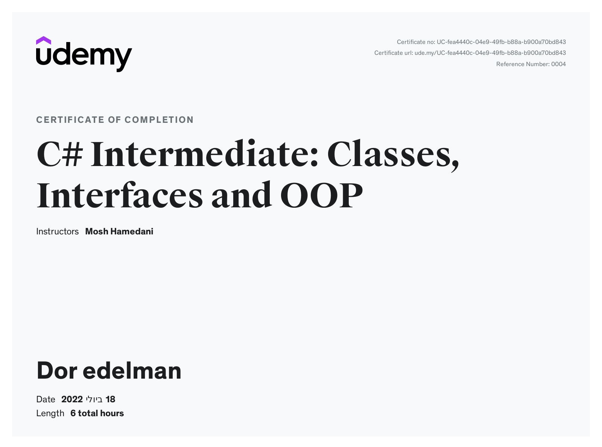
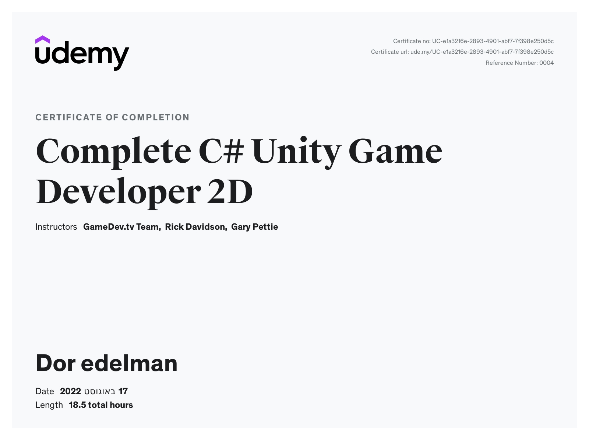
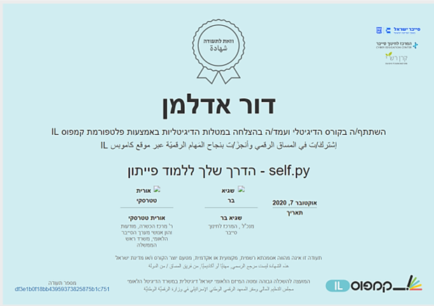

  
  ### About me:
  

Hey there ! 👋 

My name is Dor Edelman ,I'm 26 years old , born and raised in Eilat.
During the COVID-19 pandemic i found myself at home for many hours seeking for entertainment , and decided to take a programming free course online just to challenge myself. for many hours i have learned from scratch the basics, and as I delved deeper into the subject, I fell in love with programming! 

After a year of self learning c and python tearing through any course i could find on anything remotly related to software development , i decided thats what i want to do in life , i found a passion of somthing and decided to chase my dream! 
Unfortunately , in my hometown, there are no institutions to study CS or requirement in the field ,
so I had to move.
I left Eilat and moved to Tel Aviv to start study Computer Science in The Academic College of Tel Aviv Yaffo.
moving out of my comfort zone is not a new thing to me , as a combat officer in the Combat Intelligence Collection Corps across the Gaza strip I have delt with life threating situations and learned how to work calmly under Sevier pressure , to accomplish my goals in precision and persistence.

Now I just can't wait to start working in the industry !
I am passionate about programming , full of motivation for learning new technologies, growth and innovation.
So , if you think I'm the right person for you, feel free to contact me !  
📧 Doredelman@gmail.com   
☎ 0532770953

---

### 🖥️ Languages and Tools:

| Property                     | Stack                                                                                                                                                                                                                                                                                                                                                                                                                                                                                                                                                                                                                                                                                                                                                                          |
| ---------------------------- | ----------------------------------------------------------------------------------------------------------------------------------------------------------------------------------------------------------------------------------------------------------------------------------------------------------------------------------------------------------------------------------------------------------------------------------------------------------------------------------------------------------------------------------------------------------------------------------------------------------------------------------------------------------------------------------------------------------------------------------------------------------------------------- |
| Programming Languages        |                                                                                                                                                          |
| Frontend Development         |                                                                                                                                                                                                                                                                                                                                                          |
| Gaming Development           |                                                                                                                                                                                                                                                                                                                                                         |
| Blockchain & CryptoCurrency: |                                                                         
---

### 💯 Certificates: (studing after school hours)

    &nbsp;
    &nbsp;
    &nbsp;
    &nbsp;
  

  
---

### 📬 Feel free to contact me:

Feel free to connect through this profile, via email or
through the social networks:

  
  
  
  

                                                                                                                                                                        
<!--
**dore96/dore96** is a ✨ _special_ ✨ repository because its `README.md` (this file) appears on your GitHub profile.

Here are some ideas to get you started:

- 🔭 I’m currently working on ...
- 🌱 I’m currently learning ...
- 👯 I’m looking to collaborate on ...
- 🤔 I’m looking for help with ...
- 💬 Ask me about ...
- 📫 How to reach me: ...
- 😄 Pronouns: ...
- ⚡ Fun fact: ...
-->
